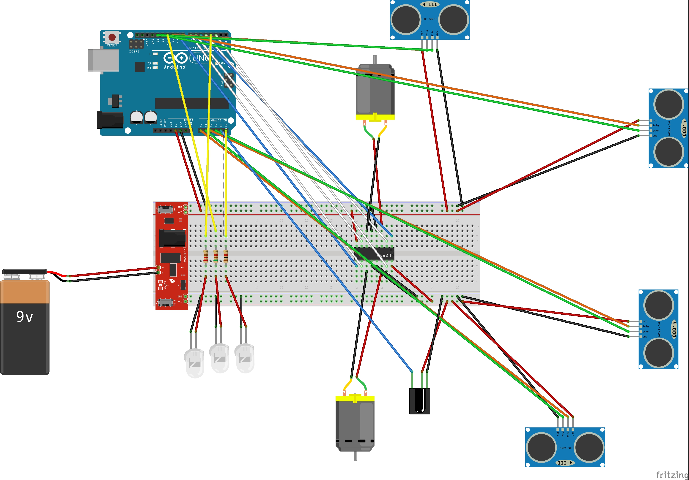
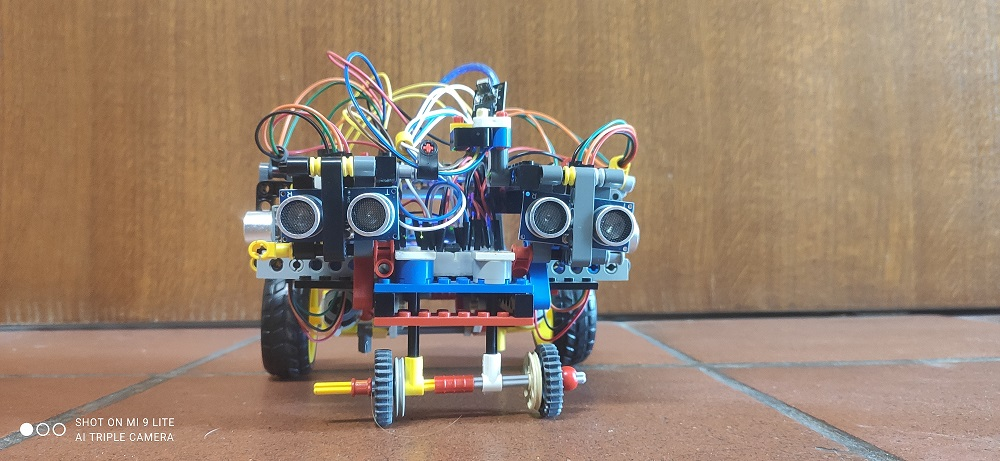

# Macchinina

Un progetto che realizza con Arduino una 'macchinina', capace di trovare e seguire il muro lungo la destra o la sinistra.

## Componenti utilizzate

- Arduino UNO R3
- 4 sensori di ultrasuoni HC-SR04
- 2 DC Motor 3-6V con gearbox
- Ponte H: L293D
- Pila 9V
- Sensore IR
- 3 LED
- 3 resistenze (220 &#937;, 1 K&#937;, 5.1 K&#937;)

## Obiettivo

Lo scopo del progetto è di creare una macchinina capace di ricevere comandi dall'utente tramite un telecomando ed eseguire la funzione associata allo specifico tasto premuto.

## Funzionamento

Tramite il sensore infrarossi viene ricevuto il codice del tasto premuto dall'utente, nel caso sia valido viene eseguita la funzione corrispondente, segnalandolo all'utente con i led (le tre resistenze, una per led, servono a diminuire la loro luminosità).
Le funzioni possibili sono 4:

- __Reach Wall__ &rarr; la macchinina si muove in avanti fino a trovare un ostacolo (muro) davanti a se, poi si ferma a qualche centimetro da esso.
- __Left Wall Follower__  &rarr;  viene seguito il muro che è tenuto alla sinistra della macchinina: grazie al sensore ultrasonico di sinistra rileva la distanza dal muro, in funzione di cui adatta la velocità dei motori per avvicinarsi o allontanarsi da esso, e grazie al sensore frontale-sinistro rileva quando si è giunti ad un angolo e quidi effettua una curva di 90° a destra. 
- __Right Wall Follower__  &rarr; funzione identica ma speculare (usa sensore di destra, e curva di 90° a sinistra quando il sensore frontale-destro rileva un ostacolo) a quella precedente.
- __Joystick__ &rarr; tramite questa funzione è possibile comandare direttamente la direzione dei motori così da muovere la macchinina realizzando di fatto un joystick. I comandi sono: avanti (entrambi i motori in avanti), sinistra (motore destro in avanti, sinistro fermo), destra (motore destro fermo, sinistro in avanti), indietro (entrambi i motori indietro), stop (entrambi i motori fermi).

Inoltre è possibile uscire da qualsiasi di queste "modalità" premendo il tasto corrispondente, che riporta la macchinina nello stato base in cui aspetta il comando dell'utente.

<table>
    <thead>
        <th></th>
        <th>Pulsante</th>
        <th>Funzione</th>
        <th>LED</th>
    </thead>
    <tbody>
        <tr>
            <td rowspan="10"></td>
            <td><b>Power</b></td>
            <td>Reach wall</td>
            <td>Verde</td>
        </tr>
        <tr>
            <td><b>Up Arrow</b></td>
            <td>Follow Left</td>
            <td>Blu</td>
        </tr>
        <tr>
            <td><b>Down Arrow</b></td>
            <td>Follow Right</td>
            <td>Verde + Blu</td>
        </tr>
        <tr>
            <td><b>Pause/Play</b></td>
            <td>Esci dalla modalità corrente</td>
            <td></td>
        </tr>
        <tr>
            <td><b>Func/Stop</b></td>
            <td>Joystick</td>
            <td>Verde + Rosso + Blu</td>
        </tr>
        <tr>
            <td><b>2</b></td>
            <td>Avanti (Joystick mode)</td>
            <td></td>
        </tr>
        <tr>
            <td><b>4</b></td>
            <td>Sinistra (Joystick mode)</td>
            <td></td>
        </tr>
        <tr>
            <td><b>6</b></td>
            <td>Destra (Joystick mode)</td>
            <td></td>
        </tr>
        <tr>
            <td><b>8</b></td>
            <td>Indietro (Joystick mode)</td>
            <td></td>
        </tr>
        <tr>
            <td><b>5</b></td>
            <td>Stop (Joystick mode)</td>
            <td></td>
        </tr>
    </tbody>
</table>

## Caratteristiche

- Dimensioni: 20x15x11 cm
- Peso: 400 g

## Librerie usate

- [IRremote](https://github.com/Arduino-IRremote/Arduino-IRremote)
- [NewPing](https://bitbucket.org/teckel12/arduino-new-ping/wiki/Home)

## Schema circuitale

## Foto

|||
| ---------| ---------- |
|  |  |
|  |  |
